# spyMissionGenerator
The spy mission generator is a flask application used to generate missions for a spy. The main application consists of three services. Two services produce random lists, one of chars, the other of numbers, and the third service combines the two to produce a mission.

## Tools
### Application Dependencies
The application requires the following dependencies to run. The dependencies can be found in the requierments.txt files in the application.

- Flask==1.1.2
- PyMySQL==0.10.1
- Flask-SQLAlchemy==2.4.4
- SQLAlchemy==1.3.18
- pytest==6.1.2
- Flask-Testing==0.8.0
- pytest-cov==2.10.1
- gunicorn==20.0.4

The dependencies required for the application can be installed using [pip](https://pip.pypa.io/en/stable/) with the command:
`pip install -r requierments.txt`
Python3 will additionally need to be installed.

### CI server
-  **Jenkins**:
The CI server.
-  **Ansible**:
Used by the CI server to configure the virtual machines running the application

### Docker
-  **Docker**:
Used to create images and run containers.
-  **Docker swarm**:
Used to deploy, manage and configure a group of containers simultaneously.
-  **Docker hub**:
Repository for pushing to and storing built images.

### Misc tools
-  **Google cloud platform**:
Hosts the virtual machines used for the CI server and the virtual machines hosting the application.
-  **Visual studio code**:
Code editor used for creating the application and its configuration files.
- **Trello**
The user epics and stories are organized using a trello board [Trello board](https://trello.com/b/2ShfPFFM/dev-ops-core-practical-project-sprint-product-backlog)

## Documentation
### ERD
The database used in the application is very simple consisting of one table. The database stores information regarding the dossier number, the missions target and the mission objective.

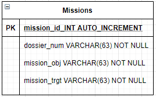

### Application structure
The application structure I began with from the practice project was as follows.

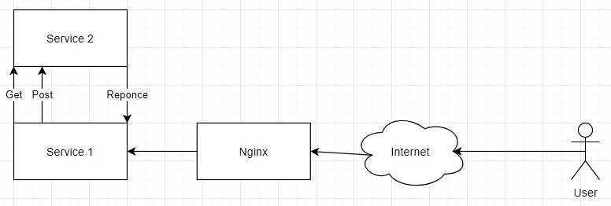

This structure was lacking in vital areas that are needed for the deliverable. To begin with, the main applications structure consisted of 2 service and not the requisite 4. This was the first modification that needed to be made. Rather than having one GET request from service 1 to service 2 and then a POST request from service 1 to service 2, two GET requests were set up. From service 1, one goes to service 2 and the other to service 3, to gather the two halves of the randomly generated actionable data. Then using this data, service 1 makes two POST requests to service 4, creating the final mission for the data created in services 2 and 3.

The original structure had the load balancer Nginx directing traffic to service 1, which was exactly what was needed. I only want the application to be accessible through service 1, with the rest of the requests being made internally.

However, the database service of the application was completely missing. I added the database service and connected it to service 1. Just before the application returns the result of the mission to the user, the mission parameters are stored within the database.

The final system structure can be found bellow.

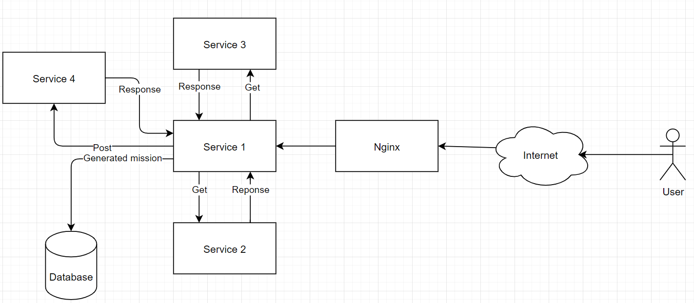

To summarise, the application consists of 4 services and a database. The user accesses the system via Nginx, which will load balance incoming traffic. The user is directed to service 1. Service 1, will obtain the number half of the mission dossier from service 2 and the letter half of the mission dossier from service 3. With these two halves of the mission dossier created, the system will send them to service 4 which will decide what the task and target are and return them to service 1. Service 1 will then store the information about the mission in the database and finally, present the dossier to the user.

### Continuous integration server
I began the development of the CI server using the pipeline developed for the practice project, which is shown bellow.

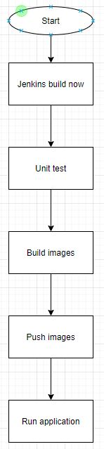

This iteration of the CI server was not suitable for the requirements of this project. This configuration of the CI server performed a role closer to that of a build server. Whilst it had the capability of unit testing, the server would not launch the application to the live environment, instead deploying the application on the Jenkins server. The first steps of the CI pipeline were in place, having the application unit tested, then built and then the image being pushed, but additional steps needed to be configured.

To make server closer to a CI server , I needed to have a live environment and to deploy the application in that environment. To configure the environment, I used ansible to install and configure docker swarm on the three virtual machines hosting the application. I then added a step to SSH in to the live environment and either deploy or update the application on those virtual machines.

I additionally needed the builds to be automated, as it was unnecessary for a person to manually start the builds. To fix this, I added a web hook from the SCM to the Jenkins server, which detected any pushes to the master branch. This would instruct the build server to send the source code through the pipeline automatically.

The updated continuous integration server's pipeline can be found bellow.

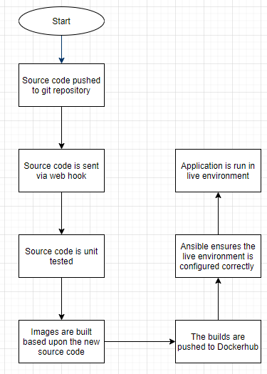

The order of the pipeline stages is organized in a way so as to avoid wasting time/resources. The unit tests are performed first, as they use containers that are usually already running and as such are not very process intensive. Additionally, if the unit tests fail, it would be wasteful to build or push an image, as the image dose not performed the required tasks, and of course, source code that has not passed unit tests should never be deployed to a live environment.

The building and pushing of images occur before deployment, as this requires very little time in comparison to the ansible configurations and the SSH deployment of the application. Additionally, I feel it is more important to create a backup of the images before deploying them, as this will make things far easier to repair, should any issues occur during the deployment.

### Risk assessment
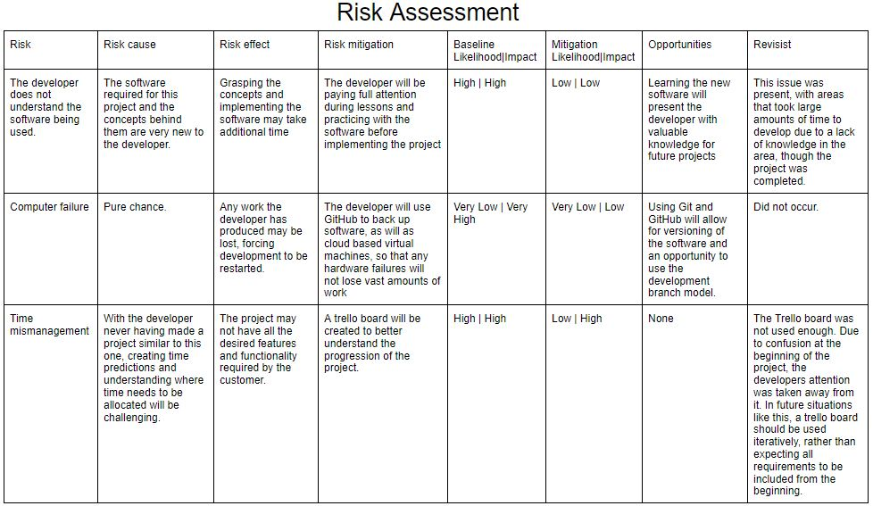
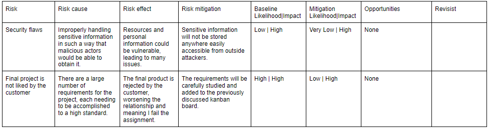

## Testing
All 4 of the services are unit tested, reaching a total coverage of 95%
### Service 1
98% coverage

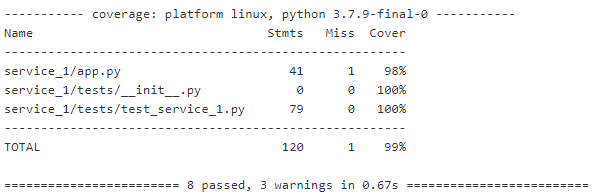
### Service 2
92% coverage

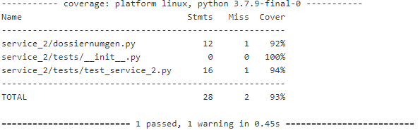
### Service 3
93% coverage

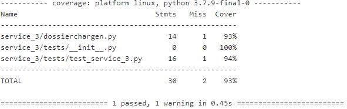
### Service 4
97% coverage

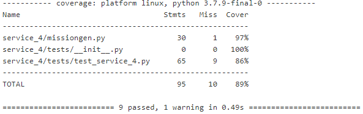